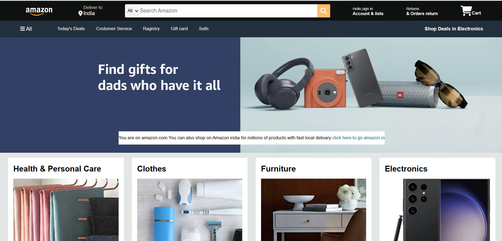

🛒 Amazon Clone (HTML + CSS)
This is a front-end clone of the Amazon website, built using only HTML and CSS. It replicates the look and feel of the original Amazon homepage and showcases layout, styling, and design skills.

📸 Preview

🔧 Tech Stack
HTML5

CSS3

✅ Features
Amazon-style header with logo, search bar, and navigation

Product sections with images and descriptions

Footer with useful links and info

Responsive layout for various screen sizes (optional if implemented)

📸 Screenshot

🚀 How to Run 
1)Download or Clone the Repo
[git clone https://github.com/your-username/amazon-clone.git](https://github.com/pratiksha950/Amazon-Clone) 
2)Open the Project Folder 
3)Run in Browser 
Double-click on index.html or open it with any browser.
